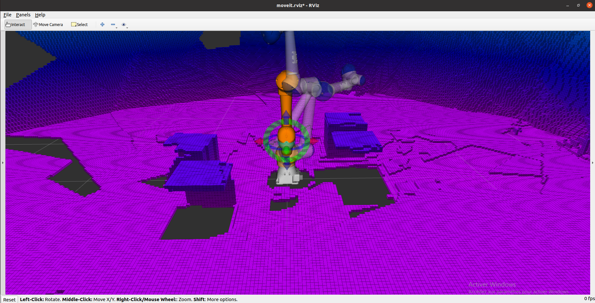
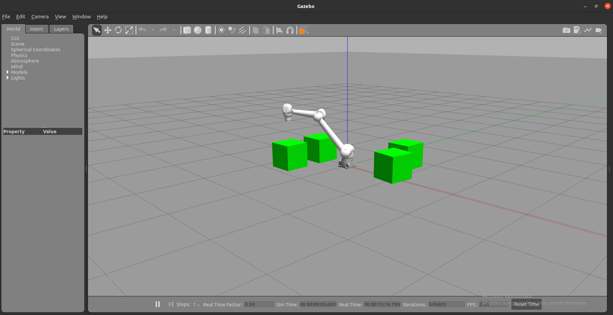

# Compte rendu intégration robotique
Chalabi Kahina - Laborie Rémi - Lotte Alexandre

## Utilisation du package ROS1

### Lancement Gazebo et Rviz
Ouvrir un terminal dans le répertoire catkin_ws. Lancer les commandes suivantes.

```
catkin build
source devel/setup.bash
roslaunch hc10_moveit_config demo_gazebo.launch
```

### Lancement de la planification et exécution de la trajectoire
Ouvrir un autre terminal dans le répertoire catkin_ws. Lancer les commandes suivantes.

```
source devel/setup.bash
rosrun hc10_moveit_config move_group_hc10.py
```

## Compte-rendu

La réalisation de ce package visait à créer un environnement de simulation du bras robotique HC10 de chez Yaskawa, incluant l'utilisation d'un capteur RGB-D pour le mapping de l'environnement du robot par construction d'une octomap.

### Planification de mouvement

Après une prise en main de l'environnement ROS et d'une mise à jour des fichiers xacro disponibles, représentant la géométrie du robot HC10, nous avons créé une liaison virtuelle entre le repère monde et la base du robot, les groupes de planification, des positions précises du robot, l'organe terminal ainsi que les contrôleurs du robot en utilisant l'utilitaire MoveitAssistant. 

Moveit est un utilitaire ROS permettant de planifier, générer et exécuter une trajectoire, tout en garantissant l'évitement des divers obstacles présents sur la trajectoire. Nous avons donc utilisé sa librairie Python et créer un script pour contrôler le mouvement du robot.

### Simulation sous Gazebo

Après maîtrise du modèle et de la géométrie du robot, nous avons utilisé l'environnement de simulation Gazebo. Via l'ajout de propriétés dans les fichiers xacro, nous pûmes simuler les contraintes et forces appliquées au robot dans la réalité, permettant une simulation plus fidèle à notre monde. 

### Couplage capteur RGB-D

Une fois le robot simulé dans la réalité, il lui fallait également la percevoir. Pour cela, nous avons intégré un capteur RGB-D lui permettant d'identifier et caractériser son environnement. En décrivant, le fonctionnement d'une kinect, il est possible de simuler un tel capteur et donc de récupérer les informations de l'environnement simulé via ce capteur virtuel. De fait, nous étions capables de retranscrire la simulation au travers de ce capteur.

Cependant, dans un premier temps, le capteur ne pouvait donner d'information car il ne connaissait pas sa position relative au robot. Il a donc fallut mettre en place une pipeline afin de donner à la caméra simulée, toutes les informations qu'elle nécessitait. Une fois sa transformée statique et relative à l'outil connue, le capteur peut émettre des données et le robot, possédant un organe de perception, peut alors percevoir son environnement. 

Le capteur extéroceptif disponible, on peut alors reconstruire à partir du nuage de points, une octomap caractérisant l'environnement.




### Intérêt de la simulation

L'intérêt notable de ce travail a été de construire et réaliser un environnement de simulation proche et représentatif de la réalité. On pourrait alors représenter extrêmement facilement l'environnement d'un vrai bras robotique HC10, en le mappant, mais également contrôler ce bras via les différents noeuds ROS mis en place durant la création de cette simulation.

